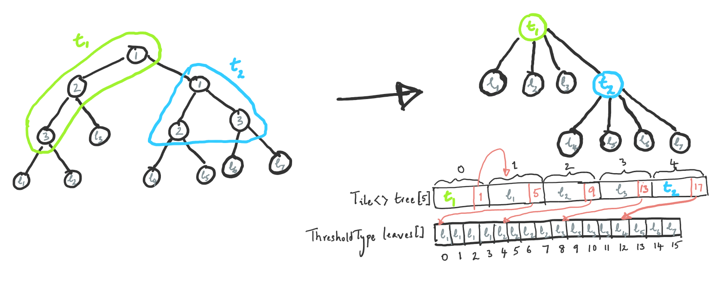

# Treebeard Model Representations

This document gives an overview of different in memory representations of the decision tree model used in the code generated by Treebeard.

## Array Based Representation

At a high level, each tree is [represented as an array](https://webdocs.cs.ualberta.ca/~holte/T26/tree-as-array.html). Each element of the array that stores the tree represents a single node (when tile size = 1) or tile (a collection of nodes). Child indices are not explicitly stored.

### Scalar (Tile Size = 1)

Each node of the tree is represented by an object of the following struct.
```C++
template <typename ThresholdType, typename FeatureIndexType>
struct Node {
  ThresholdType threshold;
  FeatureIndexType featureIndex;
};
```
The generated code to walk each tree is the equivalent of the following C++ code.
```C++
// ThresholdType and FeatureIndexType are specified as input to Treebeard (at least currently)
Node<ThresholdType, FeatureIndexType> tree[N]; // Buffer to hold all nodes in the tree

ResultType Prediction_Function(...) {
  // ...
  size_t i = 0;
  while (tree[i].featureIndex != -1) { // While we've not reached a leaf
    ThresholdType feature = x[tree[i].featureIndex]; // Read the required feature from the current row
    size_t comparison = feature >= tree[i].threshold;
    i = 2*i + 1 + comparison; // Move to the left child if (feature < threshold), else right child
  }
  ThresholdType prediction = tree[i].threshold;
  // ...
}
```
### Vector (Tile Size > 1)

Connected groups of nodes of the decision tree are grouped together into a single tile. Each tile is evaluated (traversed) using vector instructions. More details about the vector evaluation of trees and the lookup table are provided [here](TileShapesAndLUT/TileShapesAndLUT.md). A tile is represented by an object of the following struct.
```C++
template <typename ThresholdType, typename FeatureIndexType, typename TileShapeIDType, int32_t TileSize>
struct Tile {
  <ThresholdType x TileSize> thresholds; // A vector of TileSize elements
  <FeatureIndexType x TileSize> featureIndices;
  TileShapeIDType tileShapeID; // An integer that uniquely identifies the shape of the current tile
};
```
The generated code to walk each tree is the equivalent of the following C++ code.
```C++
// ThresholdType, FeatureIndexType, TileShapeIDType, TileSize are specified as input to Treebeard (at least currently)
Tile<ThresholdType, FeatureIndexType, TileShapeIDType, TileSize> tree[N]; // Buffer to hold all nodes in the tree

// A lookup table that determines the child index of the next tile given
// the tileShapeID and the outcome of the vector comparison on the current tile
int16_t LUT[NUM_TILE_SHAPES, pow(2, TileSize)]; 

ResultType Prediction_Function(...) {
  // ...
  size_t i = 0;
  while (tree[i].featureIndices[0] != -1) { // While we've not reached a leaf
    <ThresholdType x TileSize> features = x[tree[i].featureIndices]; // **Gather** the required feature from the current row
    <bool x TileSize> comparison = features < tree[i].thresholds;
    
    // Pack the bits in the comparison vector into an integer, currently implemented as a bitcast
    size_t comparisonIndex = CombineBitsIntoInt(comparison); 
    
    // Read the child index of the tile we need to move to next
    int16_t childIndex = LUT[tree[i].tileShapeID, comparisonIndex];
    
    // A tile of TileSize nodes has (TileSize+1) children
    i = (TileSize+1)*i + 1 + childIndex; 
  }
  ThresholdType prediction = tree[i].thresholds[0];
  // ...
}
```

Even though this representation is simple, the memory required even for reasonable sized models is very large. The memory footprint ends up being close to 20X that of the scalar representation. Storing leaves as full tiles (even though leaves just have to represent one value) and the empty space introduced due to the array based representation of trees that are not complete account for most of the increase. The sparse representation described next tries to address these issues.

## Sparse Representation

The sparse representation tries to address the large memory footprint of the array based representation by doing the following. 
* To eliminate wasted space in the array representation, add a child pointer to each node. This points to the first child of the node. All children of a node are stored contiguously.
* For the vector case, leaves are stored in a separate array. We found that, across all models with uniform tiling, >95% of leaves are such that all their siblings are also leaves. Such leaves are directly moved into the leaves array while for leaves that are "internal", an additional hop is added by making the leaf tile a comparison tile and all its children are made leaves with the same value as the original leaf.

### Scalar (Tile Size = 1)

Each node of the tree is represented by an object of the following struct.
```C++
template <typename ThresholdType, typename FeatureIndexType, typename ChildPointerType>
struct Node {
  ThresholdType threshold;
  FeatureIndexType featureIndex;
  ChildPointerType childPointer;
};
```
The generated code to walk each tree is the equivalent of the following C++ code.
```C++
// ThresholdType, FeatureIndexType and ChildPointerType are specified as input to Treebeard (at least currently)
Node<ThresholdType, FeatureIndexType, ChildPointerType> tree[N]; // Buffer to hold all nodes in the tree

ResultType Prediction_Function(...) {
  // ...
  size_t i = 0;
  while (tree[i].featureIndex != -1) { // While we've not reached a leaf
    ThresholdType feature = x[tree[i].featureIndex]; // Read the required feature from the current row
    size_t comparison = feature >= tree[i].threshold;
    i = tree[i].childPointer + comparison; // Move to the left child if (feature < threshold), else right child
  }
  ThresholdType prediction = tree[i].threshold;
  // ...
}
```
### Vector (Tile Size > 1)

The following diagram shows some of the details of the vector sparse representation.


The tree on the left of the diagram is the actual decision tree with the nodes grouped into tiles $t_1$ and $t_2$. The tree on the right is the tree of tiles. The arrays depicted below show how the tree is represented in memory. The first array ($\texttt{tree}$) is an array of tiles and has 5 elements. Each element of the array represents a single tile and has the thresholds of the nodes, the feature indices, [a tile shape ID](TileShapesAndLUT/TileShapesAndLUT.md) and a pointer to the first child (shown explicitly in red). 

As a specific example, consider the tile $t_1$. The tile has four children -- $l_1$, $l_2$, $l_3$ and $t_2$ in that order (left to right). These tiles are stored contiguously in the $\texttt{tree}$ array and a pointer to the first of these, $l_1$ is stored in the tile $t_1$ (the index 1 is stored in the tile $t_1$ as shown). 

Now consider the tile $t_2$. Since all children of the tile $t_2$ are leaves, they are all moved into the $\texttt{leaves}$ array. To store a pointer into the $\texttt{leaves}$ array, we add $\texttt{len(tree)}$ to the element index in the $\texttt{leaves}$ array. The tile $t_2$'s child is the element at index 12 of the $\texttt{leaves}$ array. Therefore, the index $12 + 5 = 17$ is stored in the tile $t_2$. (Any index $i$ that is greater than the length of the $\texttt{tree}$ array is regarded as an index into the $\texttt{leaves}$ array. The index into the $\texttt{leaves}$ array is $i - \texttt{len(tree)}$.)

The other aspect of the representation is that an extra hop is added for the leaves $l_1$, $l_2$ and $l_3$ in order to simplify code generation. This enforces the invariant that all leaves are stored in the leaves array and  simplifies checking whether we've reached a leaf. Therefore, 4 new leaves are added as children for each of the original leaves $l_1$, $l_2$ and $l_3$. Each of these 12 newly added leaves has the same value as its parent. These are the first 12 elements of the $\texttt{leaves}$ array.


In the generated code, as before, each tile is evaluated (traversed) using vector instructions. A tile is represented by an object of the following struct. One thing to note is that when a tile has its children in the leaves array, the child pointer (that is an index into the leaf array) is stored as (N + index) where N is the size of the array containing all the non-leaf tiles of the tree.
```C++
template <typename ThresholdType, typename FeatureIndexType, 
          typename TileShapeIDType, typename ChildPointerType, int32_t TileSize>
struct Tile {
  <ThresholdType x TileSize> thresholds; // A vector of TileSize elements
  <FeatureIndexType x TileSize> featureIndices;
  ChildPointerType childPointer;
  TileShapeIDType tileShapeID; // An integer that uniquely identifies the shape of the current tile
};
```
The generated code to walk each tree is the equivalent of the following C++ code.
```C++
// ThresholdType and FeatureIndexType are specified as input to Treebeard (at least currently)
Tile<ThresholdType, FeatureIndexType, TileShapeIDType, ChildPointerType, TileSize> tree[N]; // Buffer to hold all nodes in the tree
ThresholdType leaves[NUM_LEAVES]; // Stores all the leaf values for the tree

// A lookup table that determines the child index of the next tile given
// the tileShapeID and the outcome of the vector comparison on the current tile
int16_t LUT[NUM_TILE_SHAPES, pow(2, TileSize)]; 

ResultType Prediction_Function(...) {
  // ...
  size_t i = 0;
  while (i < N) { // While we've not reached a leaf (all tiles in the array "tree" are not leaves)
    <ThresholdType x TileSize> features = x[tree[i].featureIndices]; // **Gather** the required feature from the current row
    <bool x TileSize> comparison = features < tree[i].thresholds;
    
    // Pack the bits in the comparison vector into an integer, currently implemented as a bitcast
    size_t comparisonIndex = CombineBitsIntoInt(comparison); 
    
    // Read the child index of the tile we need to move to next
    int16_t childIndex = LUT[tree[i].tileShapeID, comparisonIndex];
    
    // A tile of TileSize nodes has (TileSize+1) children
    i = tree[i].childPointer + 1 + childIndex; 
  }
  ThresholdType prediction = leaves[i - N];
  // ...
}
```


