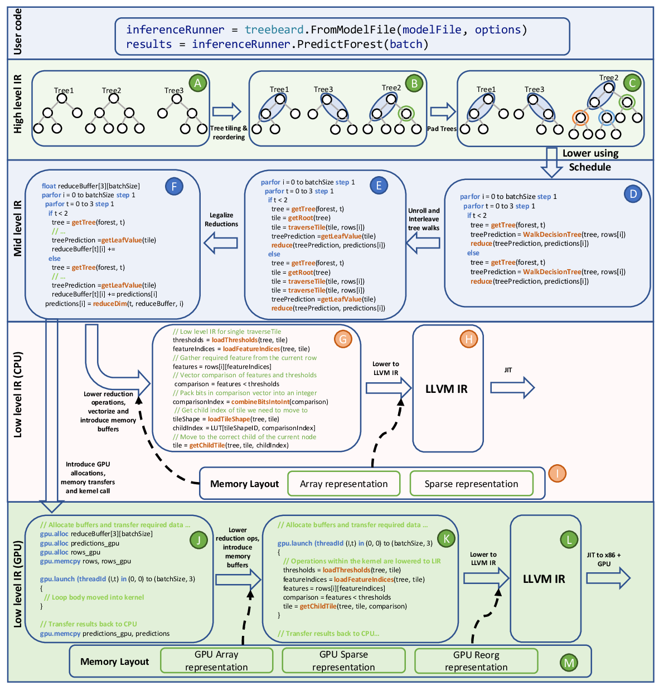

# Treebeard Overview

Treebeard takes a serialized decision tree ensemble as input (For example
XGBoost JSON, ONNX etc.) and generates an optimized inference function. 
Treebeard automatically generates an optimized inference function from 
the serialized model and can either target CPUs or GPUs. 
Figure \ref{Fig:Overview} shows the structure of the Treebeard compiler. 
The inference computation is lowered through three intermediate representations
-- high-level IR (HIR), mid-level IR (MIR) and low-level IR (LIR). The LIR is
finally lowered to LLVM and then JIT'ed to the specified target processor.

In HIR, the model is represented as a collection of binary trees. This abstraction
allows the implementation of optimizations that require the manipulation of the model
or its constituent trees. In Figure \ref{Fig:LoweringExample}, (A) 
shows this representation for a model with three trees. 
In HIR, Treebeard tiles tree nodes together to convert
the binary tree to an n-ary tree as shown in (B). Trees are also 
reordered to enable better code generation and padded to allow more 
efficient traversal as shown in (C). While these are the optimizations currently 
implemented in Treebeard, these are by no means the only ones that 
are enabled by HIR. It is not difficult to imagine optimizations 
such as tree pruning for specified accuracy levels for example.
These optimizations and rewrites that are performed on the domain-specific 
HIR would have been much on a traditional loop based IR or even in 
other IRs within Treebeard.

After these model-level optimizations are performed on the HIR, the 
code is lowered to the mid-level IR (MIR) as dictated by a user specified schedule
((C) to (D) in Figure \ref{Fig:LoweringExample}). The schedule specifies how
the iteration space that goes over the trees and input rows is to be traversed. 
It specifies how the iteration space is to be tiled, which loops are to be
parallelized, which loops are to be mapped to GPU grid and block dimensions etc.
(Details in Section \ref{Sec:SchedulingLang}). MIR is a loop-based IR that 
explicitly encodes details of the iteration space has to be traversed. However, 
it still abstracts details about the in-memory representation of the model. 
Optimizations such as tree-walk unrolling and interleaving are performed 
on the MIR ((E)). Subsequently, reduction operations are split and rewritten 
to correctly and explicitly implement reduction in the presence of 
parallel loops ((F)). More details of this process that we call 
\emph{legalization} are in Section \ref{Sec:Reduction}. Another important 
point to note is that MIR is independent of the target processor and therefore
all optimizations on MIR can be reused across CPU and GPU compilation.

The MIR is then further lowered to a low-level IR (LIR). This is the
level at which the compilation pipeline diverges for CPUs and GPUs. In 
the GPU compilation pipeline, the required memory transfers and kernel
invocations are inserted into the LIR ((J)). Additionally, buffers 
to hold model values are inserted and tree operations are lowered to
explicitly refer to these buffers. This lowering is controlled by 
a plugin mechanism where different in-memory representations can 
be added to the compiler by implementing an interface. These plugins
provide information required for the lowering of MIR to LIR as well as 
the lowering to LLVM IR as shown in Figure \ref{Fig:LoweringExample}.
Again, a significant amount of code is shared between the
CPU and GPU pipelines for representations that are common between them
(Array and Sparse representations). Vectorization of tree traversals 
is also explicitly represented in LIR.

To reiterate, the following are the salient points of Treebeard's design.
1. The compiler uses three intermediate representations (IRs) to
represent the inference computation at different levels of abstraction. This
allows different optimizations to be performed and also allows us to share
infrastructure between compilation pipelines for different target processors.

2. The specification of how the inference computation is to be lowered to 
loops is not encoded directly in the compiler. Instead, this 
is specified as an input to the compiler using a scheduling language that is 
specialized for decision tree inference computations (Section \ref{Sec:SchedulingLang}).
This separation allows us to build optimizations and schedule exploration 
mechanisms independent of the core compiler (Section \ref{AutoTuneHeuristic}). 
The scheduling language also exposes details like parallelization, optimization
of reductions (vectorization, use atomics, shared memory on GPUs etc.).

3. Treebeard has been designed to keep the optimization passes and code 
generator independent of the in-memory representation finally used for the model. To achieve 
this, Treebeard specifies an interface to implement that provides the necessary 
capabilities to the code generator as a plugin. This interface abstracts several details
on how model values are stored. In particular, it abstracts the actual layout of 
the memory buffers, how to load model values like thresholds and feature indices, how 
to move from a node to its children and determining whether a node is a leaf.
This design allows us to write each memory representation as a standalone plugin 
and reuse the rest of the compiler infrastructure.
